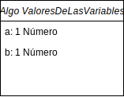
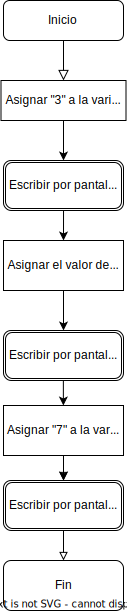
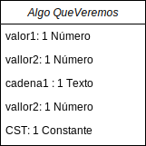
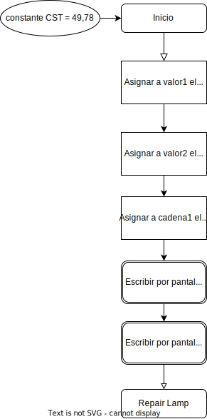
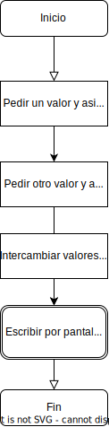
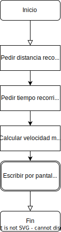

# Ejercicios
## 1. Valores de las variables
### ¿Cuáles serán los valores de las variables a y b después de cada línea del siguiente algoritmo?

Inicio 

a=" ", b=" "  

   a <- 3  
   a="3", b=" "
  
   escribir("a = " & a)  
   a="3", b=" "
   
   b<-a+5  
   a="3", b="8"
   
   escribir("a = " & a & " y b = " & b)  
   a="3", b="8"
   
   a<-7 
   a="7", b="8"
   
   escribir("a = " & a & " y b = " & b)  
   a="7", b="8"
   
Fin 
a="7", b="8"

### UML

### FLOWCHART

## 2. ¿Qué se muestra?
### ¿Qué veremos al ejecutar el siguiente algoritmo?

Lo mostrado por pantalla sera:

Test , valor2 = 8

4 # 49,78

### UML

### FLOWCHART

## 3. ¿Qué hace?
### ¿Qué hace este algoritmo?

Este algoritmo pide al usuario 2 valores, los asigna a dos variables, intercambia los valores de las variables y luego las esribe por pantalla

### UML

### FLOWCHART

## 4. Velocidad media
### Escriba un algoritmo que calcule la velocidad media de desplazamiento del usuario.

Algo VelocidadMedia

variable distancia,tiempo: entero
varable velocidad: entero

Inicio

   #pedimos los valores
   
   distamcia <- enter("Introduzca la distancia recorrida (km). ")
   
   tiempo <- enter("Introduzca el tiempo del recorrido (min). ")
   
   #calculamos
   
   velocidad <- (distancia * 60) /tiempo
   
   escribir("Se ha desplazado a una velocidad de " & velocidad & "km/h.")
   
Fin   

### UML

### FLOWCHART

